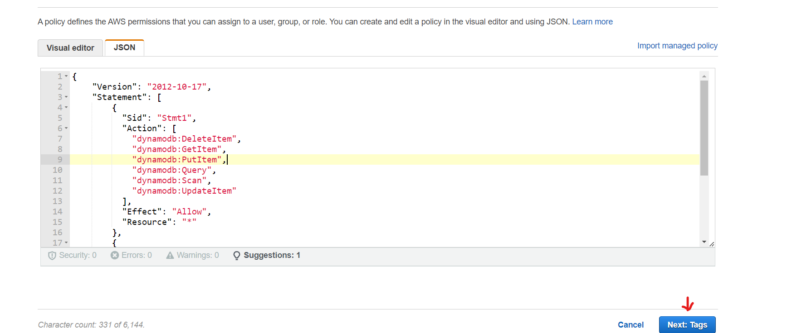
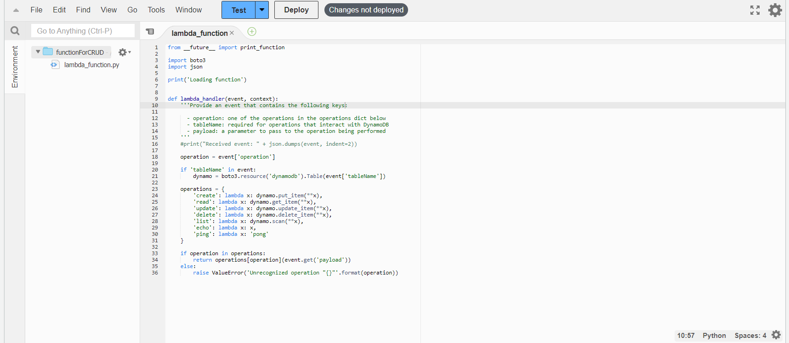
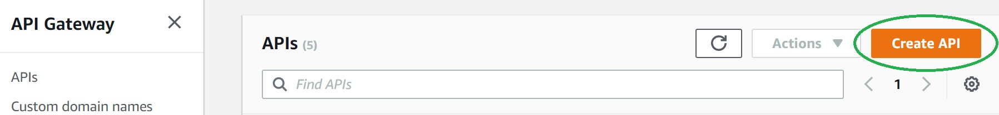

# Serverless API design on AWS

( For accessing AWS you can create [AWS free tier account](https://aws.amazon.com/free/?trk=09863622-0e2a-4080-9bba-12d378e294ba&sc_channel=ps&s_kwcid=AL!4422!3!453325184854!e!!g!!aws%20free%20tier&ef_id=Cj0KCQiA9YugBhCZARIsAACXxeI5TnaXr5gEY6MEZcf8EqWMoG3MIXbmYjDEdzcRWWo920rBxZpHysAaAt_9EALw_wcB:G:s&s_kwcid=AL!4422!3!453325184854!e!!g!!aws%20free%20tier&all-free-tier.sort-by=item.additionalFields.SortRank&all-free-tier.sort-order=asc&awsf.Free%20Tier%20Types=*all&awsf.Free%20Tier%20Categories=*all) )

Let's start with the High Level Design.


In this lab we are going to use AWS service like API Gateway, Lambda and Dynamo DB for creating an API for adding details or any type of content to DynamoDB (NoSQL Database).

### API Gateway:

Amazon API Gateway is a fully managed service provided by Amazon Web Services (AWS) that makes it easy for developers to create, deploy, and manage APIs (Application Programming Interfaces) at any scale. It acts as a "front door" for applications to access data, business logic, or functionality from back-end services.

### AWS Lambda:

AWS Lambda is a serverless compute service provided by Amazon Web Services (AWS). It allows developers to run code without provisioning or managing servers, making it easier to build scalable, event-driven applications.

With Lambda, developers can upload their code in the form of a function and AWS takes care of provisioning the necessary infrastructure to run it. Lambda supports a variety of programming languages, including Node.js, Python, Java, C#, and Go, making it a versatile choice for building serverless applications.

Lambda functions can be triggered by a variety of events, such as changes to data in Amazon S3, updates to a DynamoDB table, or API Gateway requests. When an event occurs, Lambda automatically scales to handle the request and executes the code in the function.

### DynamoDB

Amazon DynamoDB is a fully managed NoSQL database service provided by Amazon Web Services (AWS). It is designed to provide low-latency, scalable, and highly available access to data for applications of any scale.
DynamoDB is a document database that stores data in JSON-like documents, known as items. One of the key features of DynamoDB is its ability to replicate data across multiple availability zones, ensuring high availability and durability.

We will create an API after that a resource inside the API and a method POST for the resource. We can create different resources as per our requirement from aws console and define method for each resource.

The POST method on the API Gateway resource supports the following DynamoDB operations:

- Create, update, and delete an item.
- Read an item.
- Scan an item.
- Other operations (echo, ping), not related to DynamoDB, that you can use for testing.

The request payload you send in the POST request identifies the DynamoDB operation and provides necessary data. For example:

The following is a sample request payload for a DynamoDB create item operation:

```json
{
  "operation": "create",
  "tableName": "CRUD_Table",
  "payload": {
    "Item": {
      "id": "1",
      "name": "Rakesh"
    }
  }
}
```

The following is a sample request payload for a DynamoDB read item operation:

```json
{
  "operation": "read",
  "tableName": "CRUD_Table",
  "payload": {
    "Key": {
      "id": "1"
    }
  }
}
```

## Setup

### AWS Console


### Create Lambda IAM Role

Create the execution role that gives your function permission to access AWS resources.

To create an execution role

1. Open IAM Dashboard

   

2. Click create role

   

3. Define role as per given image below and click next

   

4. Click on create policy

   

5. Click JSON and copy below permissions and click next

   - Permissions – Custom policy with permission to DynamoDB and CloudWatch Logs. This custom policy has the permissions that the function needs to write data to DynamoDB and upload logs.

   ```json
   {
     "Version": "2012-10-17",
     "Statement": [
       {
         "Sid": "Stmt1428341300017",
         "Action": [
           "dynamodb:DeleteItem",
           "dynamodb:GetItem",
           "dynamodb:PutItem",
           "dynamodb:Query",
           "dynamodb:Scan",
           "dynamodb:UpdateItem"
         ],
         "Effect": "Allow",
         "Resource": "*"
       },
       {
         "Sid": "",
         "Resource": "*",
         "Action": [
           "logs:CreateLogGroup",
           "logs:CreateLogStream",
           "logs:PutLogEvents"
         ],
         "Effect": "Allow"
       }
     ]
   }
   ```

   

6. Click on next and then click on create policy

   

7. Select the created policy and click next

   

8. Give name, description and click on create role

   

   

9. Role Created

   

### Create Lambda Function

**To create the function**

1. Search for Lambda on AWS Console and open it

2. Click "Create function" in AWS Lambda Console

   

3. Select "Author from scratch". Use name of your choice, select **Python 3.7** as Runtime. Under Permissions, select "Use an existing role", and select IAM role that we created, from the drop down and click on "Create function"

   

4. Replace the boilerplate coding with the following code snippet, click "Save"

   

**Example Python Code**

```python
from __future__ import print_function

import boto3
import json

print('Loading function')


def lambda_handler(event, context):
  '''Provide an event that contains the following keys:

    - operation: one of the operations in the operations dict below
    - tableName: required for operations that interact with DynamoDB
    - payload: a parameter to pass to the operation being performed
  '''
  #print("Received event: " + json.dumps(event, indent=2))

  operation = event['operation']

  if 'tableName' in event:
      dynamo = boto3.resource('dynamodb').Table(event['tableName'])

  operations = {
      'create': lambda x: dynamo.put_item(**x),
      'read': lambda x: dynamo.get_item(**x),
      'update': lambda x: dynamo.update_item(**x),
      'delete': lambda x: dynamo.delete_item(**x),
      'list': lambda x: dynamo.scan(**x),
      'echo': lambda x: x,
      'ping': lambda x: 'pong'
  }

  if operation in operations:
      return operations[operation](event.get('payload'))
  else:
      raise ValueError('Unrecognized operation "{}"'.format(operation))
```

After saving click on "Deploy".

### Test Lambda Function

Let's test our newly created function. We haven't created DynamoDB and the API yet, so we'll do a sample echo operation. The function should output whatever input we pass.

1. Click the arrow on "Select a test event" and click "Configure test events"

   

2. Paste the following JSON into the event. The field "operation" dictates what the lambda function will perform. In this case, it'd simply return the payload from input event as output. Click "Create" to save

   ```json
   {
     "operation": "echo",
     "payload": {
       "somekey1": "show this value",
       "somekey2": "second value"
     }
   }
   ```

   

3. Click "Test", and it will execute the test event. You should see the output in the console

   

We're all set to create DynamoDB table and an API using our lambda as backend!

### Create DynamoDB Table

Create the DynamoDB table that the Lambda function uses.

**To create a DynamoDB table**

1. Open the DynamoDB console.
2. Choose Create table.

   

3. Create a table with the following settings.
   - Table name – CRUD_Table
   - Primary key – id (string)
4. Choose Create.

   

### Create API

**To create the API**

1.  Go to API Gateway console
2.  Click Create API

    

3.  Select REST and give the API name as "DynamoDBOperations", keep everything as is and click "Create API"

    

4.  Each API is collection of resources and methods that are integrated with backend HTTP endpoints, Lambda functions, or other AWS services. Typically, API resources are organized in a resource tree according to the application logic. At this time you only have the root resource, but let's add a resource next,
    Click "Actions", then click "Create Resource"

        

5.  Input "DynamoDBManager" in the Resource Name, Resource Path will get populated. Click "Create Resource"

    

6.  Let's create a POST Method for our API. With the "/dynamodbmanager" resource selected, Click "Actions" again and click "Create Method".

    

7.  Select "POST" from drop down , then click checkmark

    

8.  The integration will come up automatically with "Lambda Function" option selected. Select the Lambda function that we created earlier. As you start typing the name, your function name will show up.Select and click "Save". A popup window will come up to add resource policy to the lambda to be invoked by this API. Click "Ok"

    

Our API-Lambda integration is done!

### Deploy the API

In this step, you deploy the API that you created to a stage called prod.

1. Click "Actions", select "Deploy API"

   

2. Now it is going to ask you about a stage. Select "[New Stage]" for "Deployment stage". Give "Prod" as "Stage name". Click "Deploy"

   
   

3. We're all set to run our solution! To invoke our API endpoint, we need the endpoint url. In the "Stages" screen, expand the stage "Prod", select "POST" method, and copy the "Invoke URL" from screen

   

### Running our solution

1.  To execute our API from local machine, we are going to use Postman. [Postman](https://www.postman.com/) is a popular software tool used by developers to test and interact with APIs (Application Programming Interfaces). It provides an easy-to-use graphical user interface that allows users to send HTTP requests to APIs and view the responses.
    To run API endpoint from Postman, select "POST" , paste the API invoke url. Then under "Body" select "raw" and paste the below JSON. Click "Send". API should execute and return "HTTPStatusCode" 200.

         

         ```json
         {
           "operation": "create",
           "tableName": "CRUD_Table",
           "payload": {
             "Item": {
               "id": "1",
               "name": "Rakesh Tiwari",
               "department": "sales"
             }
           }
         }
         ```

         

2.  To validate that the item is indeed inserted into DynamoDB table, go to Dynamo console, select "lambda-apigateway" table, select "Items" tab, and the newly inserted item should be displayed.

    

3.  To get all the inserted items from the table, we can use the "list" operation of Lambda using the same API. Pass the following JSON to the API, and it will return all the items from the Dynamo table

    ```json
    {
      "operation": "list",
      "tableName": "lambda-apigateway",
      "payload": {}
    }
    ```

4.  To delete a particuar item from the table, we can use the "delete" operation of Lambda using the same API. Pass the following JSON to the API, and it will return all the items from the Dynamo table

    

    ```json
    {
      "operation": "delete",
      "tableName": "CRUD_Table",
      "payload": {
        "Key": {
          "id": "1"
        }
      }
    }
    ```

Yeah!!! We have successfully created a serverless API using API Gateway, Lambda, and DynamoDB!

## Cleanup

Let's clean up the resources we have created for this lab.

### Cleaning up DynamoDB

To delete the table, from DynamoDB console, select the table "lambda-apigateway", and click "Delete"


To delete the Lambda, from the Lambda console, select lambda "LambdaFunctionOverHttps", click "Actions", then click Delete


To delete the API we created, in API gateway console, under APIs, select "DynamoDBOperations" API, click "Actions", then "Delete"


To delete the IAM role, in IAM dashboard go to roles and select the created role, click "Delete"


